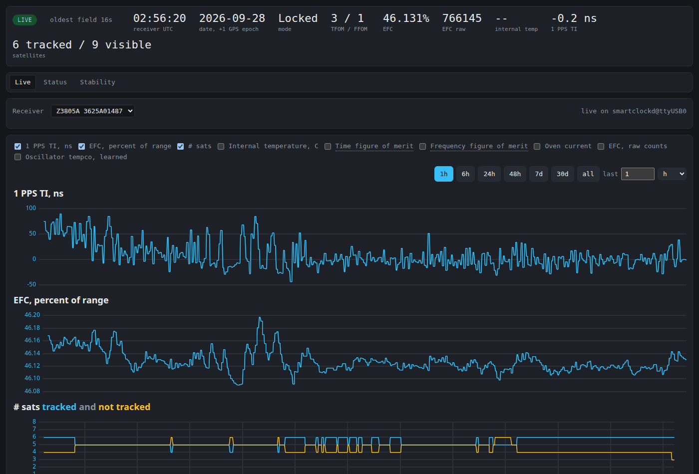
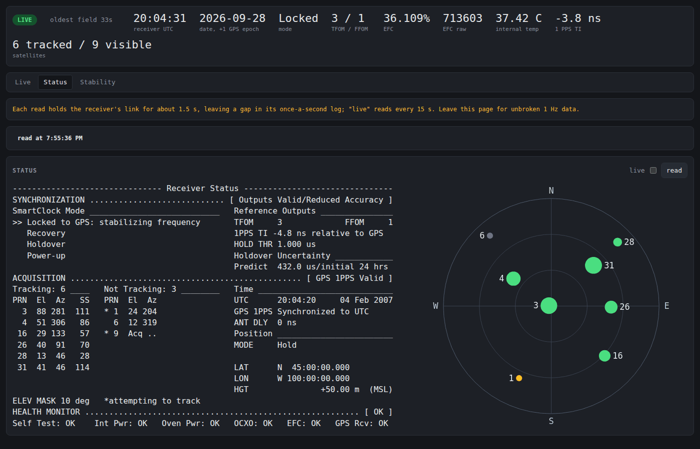
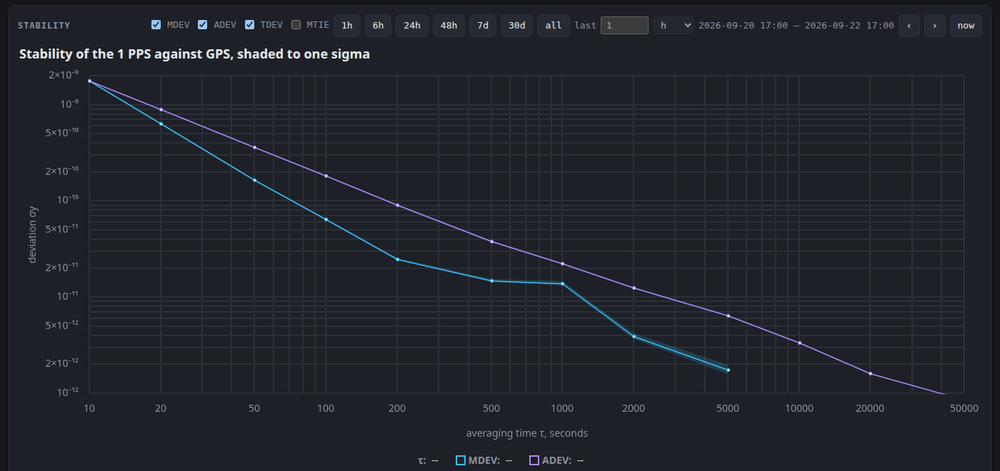
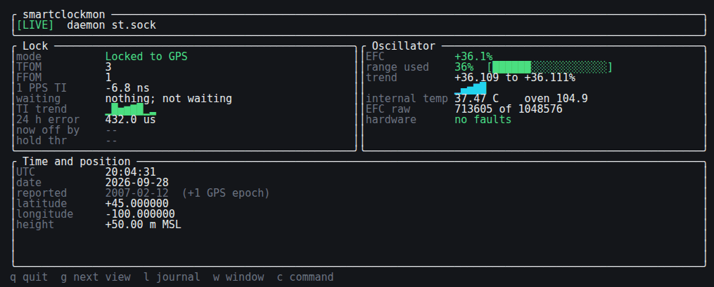

# smartclockmon

A Rust library, logging daemon, terminal monitor and browser view for
HP / Symmetricom SmartClock GPS time and frequency reference
receivers, over RS-232.

| | |
| - | - |
|  |  |
|  | The status page and the monitor are shown against the simulator. |

## Status

Running as a service on a bench of three units, logging continuously.
`PLAN.md` holds the design decisions, open questions and known
defects; `docs/hardware-investigations.md` what the bench has yet to
settle.

## Parts

| | |
| - | - |
| `smartclock` | the library: transports, SCPI framing, the command table, parsers, the status screen scraper, the polling task, and the Allan deviation |
| `smartclockd` | holds the serial port, logs to SQLite, serves clients over a local socket |
| `smartclockmon` | terminal monitor: a dashboard, history graphs, the journal, the status screen and stability |
| `smartclock-cli` | one-shot queries, `diagnose`, transcript capture, sweeping for undocumented commands, reading a unit's ROM and EEPROM through its debug console, and loading firmware with model and image compatibility checks (see [firmware notes](docs/firmware.md#the-flasher)) |
| `smartclock-exporter` | Prometheus metrics for every receiver on the host, from the daemons' own readings |
| `smartclock-web` | a browser view: live state, history you can zoom, and pages for the status screen and for stability |
| `smartclock-sim` | a simulated receiver, in process for tests and over TCP for driving the real daemon |

## Running it

Build with `make`, or `make deb` for a package.  The package runs
one daemon instance per serial port, named by the port:
`systemctl enable --now smartclockd@ttyUSB0`, with shared settings in
`/etc/default/smartclockd`; see `docs/running.md`.

Run by hand, the daemon holds the port and everything else is its
client:

    smartclockd --device /dev/serial/by-id/usb-... \
                --log-dir . \
                --socket /tmp/smartclockd.sock

    smartclockmon --socket /tmp/smartclockd.sock
    smartclock-web --socket /tmp/smartclockd.sock --log-dir .        # http://127.0.0.1:9980/
    smartclock-exporter --socket /tmp/smartclockd.sock               # http://127.0.0.1:9979/metrics

Installed, the web view and the exporter need no options: both read
every daemon's socket under `/run/smartclockd` and every log under
`/var/lib/smartclockd`.  `docs/views.md` says what each view shows and
why.

Without a receiver, use the simulator; every tool takes
`tcp://host:port` wherever it takes a device path:

    smartclock-sim 127.0.0.1:5025            # --model z3801a --no-echo for the Z3801A's framing
    smartclockd     --device tcp://127.0.0.1:5025 ...
    smartclock-cli  --device tcp://127.0.0.1:5025 diagnose

`make ci` runs the checks CI does; `make test-web` runs the browser
tests, after `make web-deps` once.

## Hardware

HP / Agilent / Symmetricom SmartClock receivers: GPS-disciplined
OCXO references that emit 10 MHz and 1 PPS and report their state over
a serial port in SCPI.

| Model  | Command tree             | Notes                                   |
| ------ | ------------------------ | --------------------------------------- |
| 58503A | `:GPS:`, `:SYNC:`        | Primary development target              |
| 58503B | `:GPS:`, `:SYNC:`        | Same tree as the 58503A                 |
| 59551A | `:GPS:`, `:SYNC:`        | Adds pulse output and event timestamping|
| Z3801A | `:PTIME:GPSYSTEM:`, `:ROSC:` | Divergent tree; different response formats |
| Z3805A | `:PTIME:GPSYSTEM:`, `:ROSC:` | Answers the Z3801A tree; verified on hardware |
| Z3816A | `:PTIME:GPSYSTEM:`, `:ROSC:` | Assumed as Z3801A; unverified          |

Their GPS engines are mid-1990s Motorola boards whose firmware
predates the GPS week rollovers of 1999 and 2019, so a unit reports a
date 1024 weeks in the past.  Time of day, 1 PPS and 10 MHz are
unaffected; the tools correct the date rather than flag a fault.
Factory serial settings are 9600 8N1; the Z3801A's port is fixed at
19200 7O1.  When the configured settings get no answer, the daemon,
monitor and CLI probe 19200 and 9600, 8N1 and 7O1.  `BENCHNOTES.md`
describes the bench.

## Documentation

| File | Contents |
| ---- | -------- |
| `docs/running.md` | installing, configuring and what the daemon does to the receiver |
| `docs/views.md` | what the monitor, the browser pages and the exporter show, and why |
| `docs/protocol.md` | how the receivers behave on the wire |
| `docs/commands.md` | the command table: which commands each tree has, how far each is confirmed, and those in no manual; generated by `make docs` |
| `docs/efc.md` | how the receiver reports its control voltage, measured at the oscillator's EFC pin |
| `docs/OCXO.md` | the oscillator itself |
| `docs/firmware.md` | what the firmware shows: the 1 PPS measurement, the disciplining loop, the GPS engine interface and the pForth console |
| [`docs/loop.html`](https://htmlpreview.github.io/?https://github.com/charlieh0tel/smartclockmon/blob/main/docs/loop.html) | the disciplining loop as a block diagram, with its update law, constants and closed-loop poles |
| [`docs/sky-comparison.html`](https://htmlpreview.github.io/?https://github.com/charlieh0tel/smartclockmon/blob/main/docs/sky-comparison.html) | a healthy 58503A against a half-deaf Z3805A, with a u-blox NEO-M8T as referee, on one antenna for 24 hours: the Z3805A hears nothing the NEO-M8T reads below 39 dB-Hz, 20 dB LNA and all |
| `docs/hardware-investigations.md` | what the firmware leaves open that only a bench can settle |
| `docs/recovery-hypothesis.md` | S1 and forced-recovery hypotheses, including modeled flash-read faults |
| `docs/z3801-keywords.md`, `docs/z3801-tree.md`, `docs/58503a-tree.md` | the SCPI keywords and command paths read from the firmware |
| `docs/screen-format-strings.md` | the status screen's printf templates |

Vendor manuals are in `third_party/`; `097-59551-02` (59551A/58503A)
and `097-z3801-01` (Z3801A) are the primary references, and
`third_party/NOTICE` lists the rest.

## License

Copyright © 2026 Christopher Hoover.  GPL-3.0-or-later.  See
`LICENSE`.

The license does not cover the vendor manuals in `third_party/`; they
remain the copyright of Symmetricom and its successors and are kept
here as protocol documentation.  See `third_party/NOTICE`.
